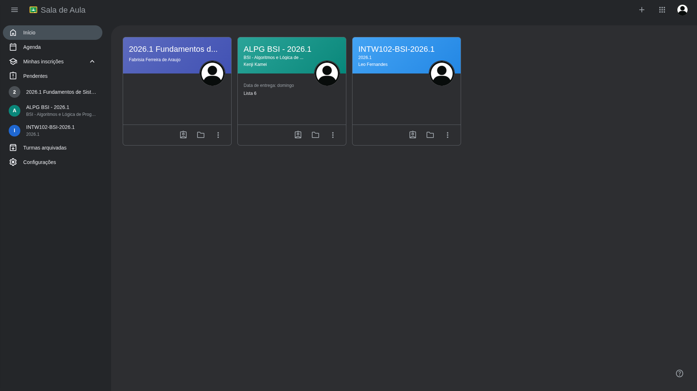
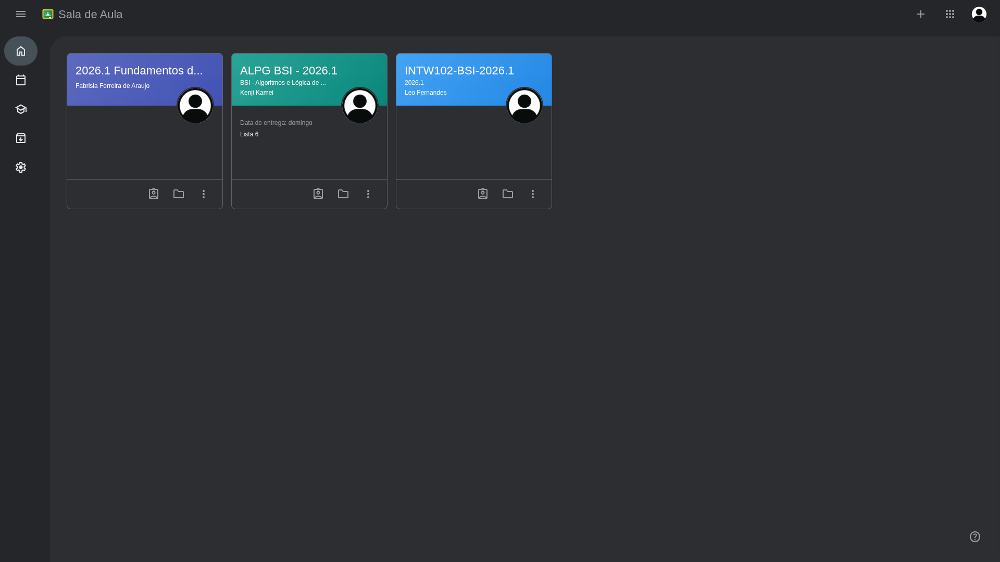
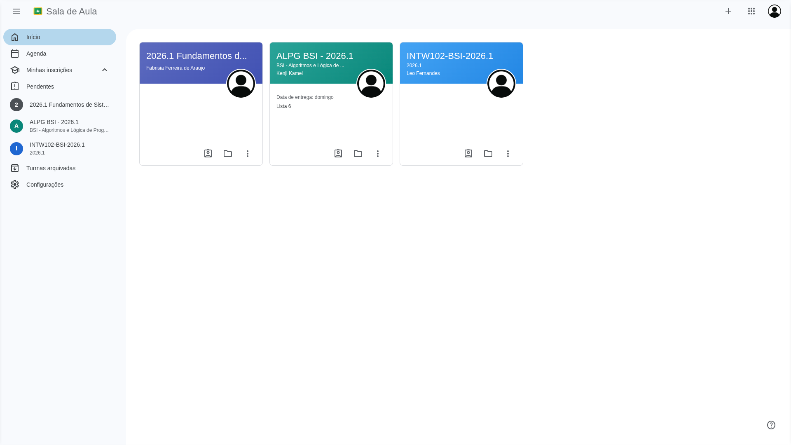
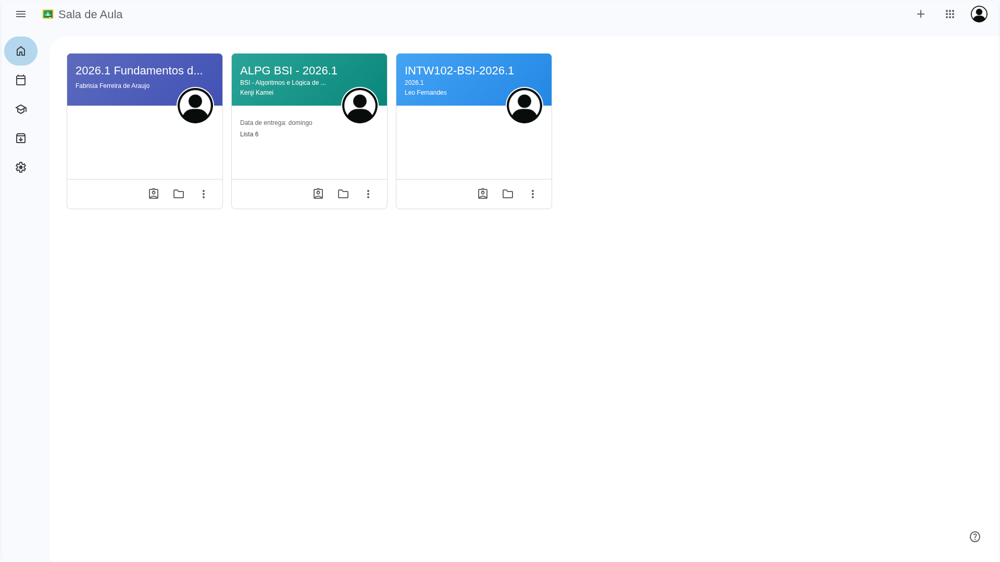
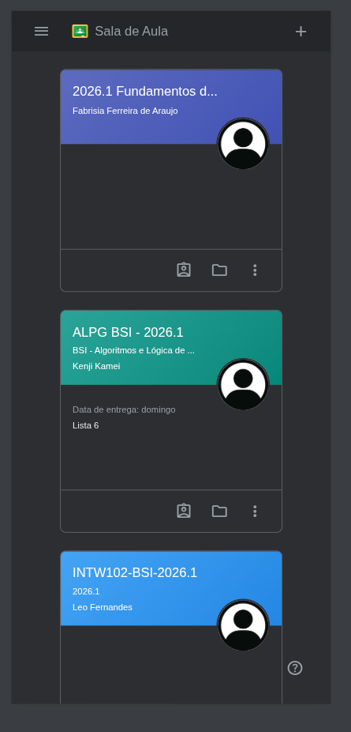
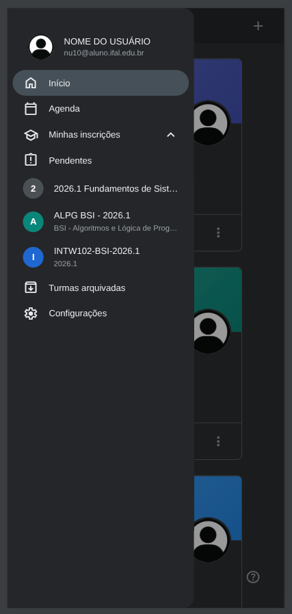
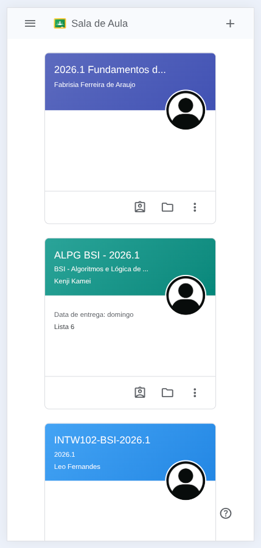
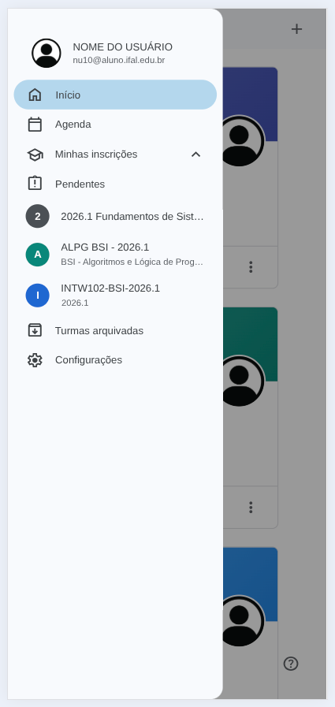

# Projeto — Recriação Responsiva

## Autor

Miguel Ferreira Laurentino

## Site Escolhido

Google Classroom

## Link do Site Original

<https://classroom.google.com>

## Objetivo Visual do Projeto

Recriar de forma responsiva a interface principal de turmas do Google Classroom, adaptando os componentes visuais e o layout para diferentes dispositivos e também modo escuro.

## Tecnologias Utilizadas

- HTML5 (Estrutura semântica e acessibilidade)
- CSS3 (Variáveis customizadas, Flexbox, CSS Grid)
- Tipografia Fluida com `clamp()`
- Modo Escuro com `prefers-color-scheme`
- Media Queries para design responsivo

## Estratégia Responsiva

Mobile-first. O CSS foi desenvolvido inicialmente com foco em telas pequenas, expandindo os layouts de grid e as barras de navegação conforme a largura da tela aumenta.

## Breakpoints

- `768px`: Tablet
- `1024px`: Desktop
- `1440px`: Monitores de alta resolução / telas grandes

## Principais Adaptações Realizadas

- **Menu Hamburguer**: Implementação de um checkbox hack utilizando `<input type="checkbox">` e `<label>` associado para abrir e fechar a barra lateral.
- **Backdrop Clicável**: Adição de um backdrop transparente/escuro sobre a página no mobile que, ao ser clicado, fecha o menu automaticamente (comportamento nativo de overlays).
- **Recolhimento no Desktop**: No desktop (telas >= 1024px), o menu hambúrguer serve para recolher e expandir o menu lateral de forma fluida com transições de margem.

## Principais Dificuldades

Implementar um comportamento deslizante completo, incluindo fechamento automático por clique externo (backdrop) e recolhimento nativo no desktop, sem usar lógica JavaScript.

## Capturas de Tela

